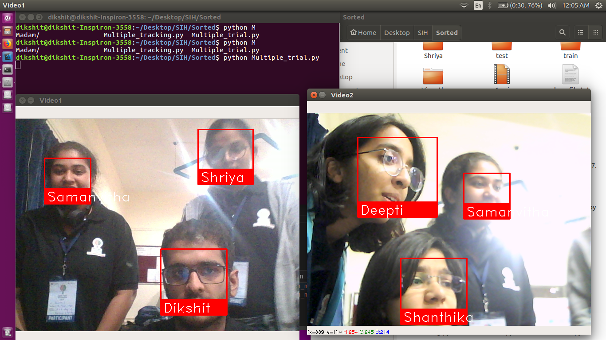
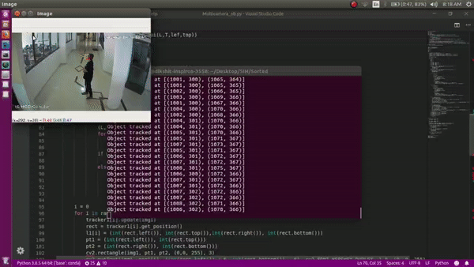

# Real-Time-Multiple-Person-Recognition-and-Tracking-for-CCTV-Camera

` Currently a repository for documentation, implementation details will be published in the future `

A surveillance system for CCTV cameras which recognizes selected multiple target individuals and tracks in real time across multiple cameras, with detection, recognition, and kernel-based tracking modules. 

A CCTV surveillance system which has the ability to recognize multiple selected individuals and track them across multiple cameras.
1.Acquisition :Multiple static CCTV cameras are considered. 
2.Face detection & Recognition: detect the faces and recognize the individuals 
3. Multiple Person Tracking: Out of the recognized individuals, track target individuals across multiple cameras. 

Facial recognition is done using HOG features and image embedding using OpenFace. We were able to perform simultaneous tracking and recognition of multiple individuals across multiple cameras in real time. 

Winning project, Smart India Hackathon 2019.

